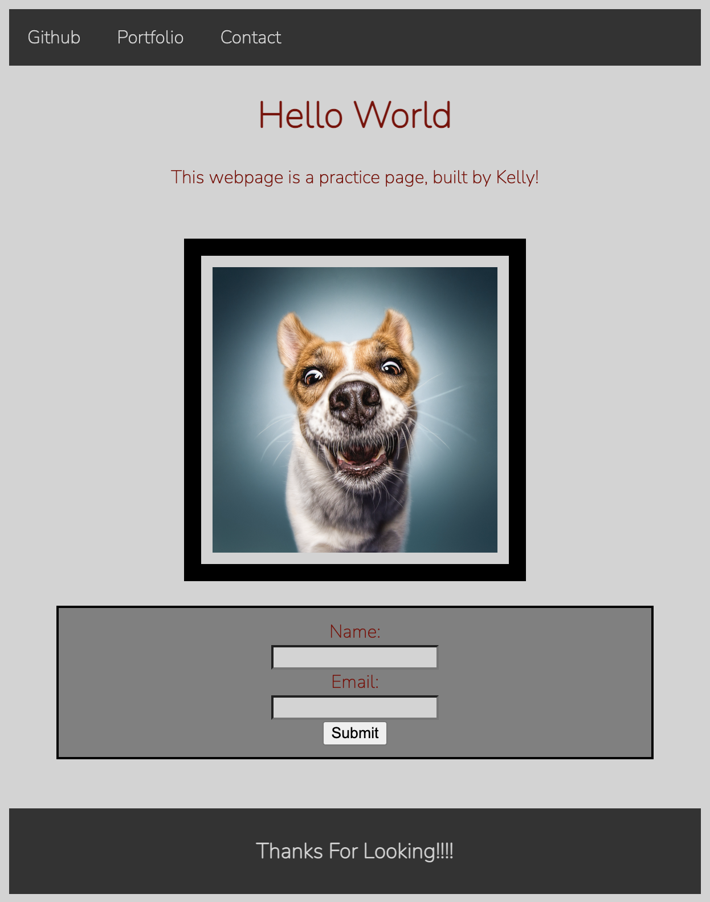

# week1-mini-project

[![Contributors][contributors-shield]][contributors-url]
[![Forks][forks-shield]][forks-url]
[![Issues][issues-shield]][issues-url]
[![MIT License][license-shield]][license-url]
[![Stargazers][stars-shield]][stars-url]
[![GitHub Watchers][github-watchers]][github-watchers-url]

# Weather API

<!-- PROJECT LOGO -->
 

  

<h3 align="center">Landing Page</h3>

  

    Mini Project - Week 1
     
    <a href="https://github.com/kemwalsh/week1-mini-project"><strong>Explore the Docs »</strong></a>
     
     
    <a href="https://kemwalsh.github.io/week1-mini-project/">View Demo</a>
    ·
    <a href="https://github.com/kemwalsh/week1-mini-project/issues">Report Bug</a>
    ·
    <a href="https://github.com/kemwalsh/week1-mini-project/issues">Request Feature</a>
  

## Description:

- As a client, I want to view a single webpage that collects a visitor's contact information.

- As a client, I want the landing page to have a header and footer.

- As a client, I want the landing page to have an image with a caption.

- As a client, I want the landing page to have a contact form.

- As a client, I want the landing page to have a polished and accessible UI.

## User Story

- It's done when the page uses semantic HTML elements.

- It's done when the page uses universal, element, and class selectors in CSS.

- It's done when the page features at least three colors in the design.

- It's done when the page uses a single font and font family for all text.

- It's done when the page uses at least two heading elements (`<h1>` through `<h6>`).

- It's done when the header is fixed to the top of the page on scroll.

- It's done when the header contains a navigation bar with three links that display inline, including a contact link.

- It's done when, if the contact link is clicked, the page jumps directly to the contact form.

- It's done when the contact form includes `input` elements for name and email.

- It's done when the contact form includes a Send button.

- It's done when the image includes a descriptive `alt` attribute.

- It's done when the page is deployed to GitHub Pages.

(<a href="#top">back to top</a>)

## Application Features:

- Links to Github and Portfolio
<!-- - See the weather for selected city with a five day forcast -->
- User friednly form
- User friendly interface

(<a href="#top">back to top</a>)

## Application Appearance and Functionality:

Website's Appearance:

<!-- Add link to gif -->

### Built With

- [HTML](https://en.wikipedia.org/wiki/HTML)
- [CSS](https://developer.mozilla.org/en-US/docs/Learn/CSS/First_steps/What_is_CSS)
- [Google Fonts](https://fonts.google.com/)
<!-- - [Javascript](https://www.javascript.com)
- [MDBootstrap](https://mdbootstrap.com/)
- [OpenweatherAPIServer](https://openweathermap.org/) -->

(<a href="#top">back to top</a>)

## Project Link

[Portfolio Repository](https://github.com/kemwalsh/week1-mini-project)

[Portfolio Live Website](https://kemwalsh.github.io/week1-mini-project/)

## Credits

List of Contributors:

1. Kelly Walsh

## Contact Info

Kelly Walsh - kellywalsh827@gmail.com
 
[![LinkedIn][linkedin-shield]][linkedin-url-kelly] [![GitHub][github-shield]][github-url-kelly]  

(<a href="#top">back to top</a>)

<!-- MARKDOWN LINKS & IMAGES -->
<!-- https://www.markdownguide.org/basic-syntax/#reference-style-links -->

[contributors-shield]: https://img.shields.io/github/contributors/kemwalsh/week1-mini-project.svg?style=for-the-badge
[contributors-url]: https://github.com/kemwalsh/week1-mini-project/graphs/contributors
[forks-shield]: https://img.shields.io/github/forks/kemwalsh/week1-mini-project.svg?style=for-the-badge
[forks-url]: https://github.com/kemwalsh/week1-mini-project/network/members
[stars-shield]: https://img.shields.io/github/stars/kemwalsh/week1-mini-project?style=social
[stars-url]: https://github.com/kemwalsh/week1-mini-project/stargazers
[issues-shield]: https://img.shields.io/github/issues/kemwalsh/week1-mini-project.svg?style=for-the-badge
[issues-url]: https://github.com/kemwalsh/week1-mini-project/issues
[license-shield]: https://img.shields.io/github/license/kemwalsh/week1-mini-project.svg?style=for-the-badge
[license-url]: https://github.com/kemwalsh/week1-mini-project/blob/master/LICENSE.txt
[linkedin-shield]: https://img.shields.io/badge/-LinkedIn-black.svg?style=for-the-badge&logo=linkedin&colorB=555
[linkedin-url-kelly]: https://www.linkedin.com/in/kellywalsh001/
[github-shield]: https://img.shields.io/badge/-Github-blueviolet.svg?style=for-the-badge&logo=Github&colorB=555
[github-url-kelly]: https://github.com/kemwalsh
[github-watchers]: https://img.shields.io/github/watchers/kemwalsh/week1-mini-project?style=social
[github-watchers-url]: https://github.com/kemwalsh/week1-mini-project/watchers
